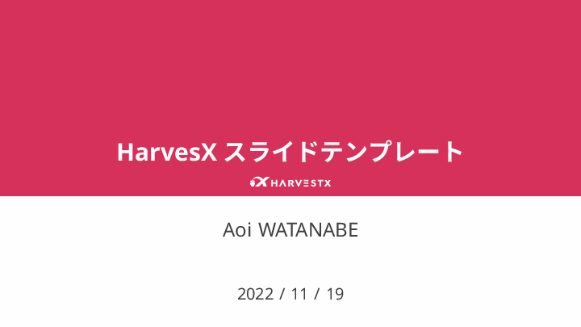

# HarvestX Presentation Template
This presentation template is powered by
- [SATySFi](https://github.com/gfngfn/SATySFi)
- [SLyDIFi](https://github.com/monaqa/slydifi)

[](./example/main.pdf)

## Setup
### Install SATySFi
Install SATySFi with the following instruction described in the original readme.
- https://github.com/gfngfn/SATySFi#install-using-satyrographos-for-non-devs

### Install SLyDIFi
SLyDIFi-related resources can be installed by the setup script.
```zsh
git clone git@github.com:HarvestX/presentation_template.git
presentation_template/setup.sh
```

## Generate PDF
```zsh
make
```

## Related
- satysfi-workshop
  - https://github.com/pickoba/satysfi-workshop
- satysfi-language-server
  - https://github.com/monaqa/satysfi-language-server

